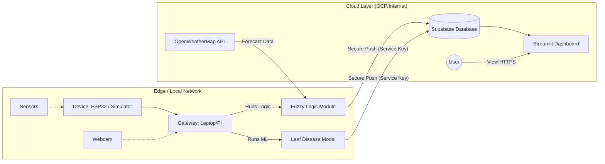

# System Design Document - Smart Irrigation System (IoT)

## 1. System Architecture
The Smart Irrigation System is an IoT application designed to optimize water usage in algaculture. It leverages a fuzzy logic inference system to make intelligent irrigation decisions based on real-time sensor data and weather forecasts.

### High-Level Architecture


### Component Description
1.  **IoT Device (ESP32 / Simulator)**:
    -   Collects environmental data (Temperature, Humidity, Soil Moisture, Rain Status).
    -   In **Simulation Mode**, it generates realistic mock data to verify system logic without hardware.
    -   Communicates with the Intelligent Component via Serial (or direct integration in simulation).

2.  **Intelligent Component (Fuzzy Logic Model)**:
    -   **File**: `Cloud/irrigation_brain.py`
    -   **Role**: Acts as an Edge Gateway. It aggregates local sensor data and fetches forecasted rain probability from OpenWeatherMap.
    -   **Decision Engine**: Uses the `scikit-fuzzy` library to compute an "Irrigation Volume" score (0-100) based on inputs.
    -   **Output**: Controls the pump (OFF/LOW/HIGH) and pushes telemetry to the Cloud Database.

3.  **Cloud Database (Supabase)**:
    -   **Role**: Stores historical sensor data and decision logs.
    -   **Tables**: `sensor_data`, `weather_data`.
    -   **Why Supabase?**: Provides a scalable PostgreSQL database with real-time capabilities and simple REST/Client API, suitable for rapid prototyping (PoC).

4.  **Dashboard (Streamlit)**:
    -   **File**: `assets/dashboard.py`
    -   **Role**: Visualizes real-time status and historical trends.
    -   **Features**: Displays metrics, charts for soil moisture/temperature, and latest weather forecast.

## 2. Design Considerations

### Decisions & Trade-offs
-   **Fuzzy Logic vs. Thresholds**:
    -   *Choice*: Fuzzy Logic.
    -   *Reason*: Agriculture is complex. A simple threshold (e.g., "Water if moisture < 30%") is inefficient. Fuzzy logic handles ambiguity (e.g., "Hot but Dry with High Rain Probability") better.
    -   *Trade-off*: Higher computational cost than simple if-else statements, but justifiable for precision agriculture.

-   **Supabase vs. GCP (Project Requirement)**:
    -   *Choice*: Supabase (for this Proof of Concept).
    -   *Reason*: Faster setup time and lower latency for retrieving real-time updates in a PoC environment.
    -   *Note*: The architecture is modular. The database client in `irrigation_brain.py` and `dashboard.py` can be swapped for GCP Firestore without changing the core business logic.

-   **Local vs. Cloud Intelligence**:
    -   *Choice*: Edge/Local Intelligence (Fuzzy Logic runs on the Gateway).
    -   *Reason*: Ensures the system can make decisions even if the internet connection is intermittent (though weather API requires internet, historical/default values are used as fallback).

## 3. Development Process

### Prerequisites
-   Python 3.9+
-   Supabase Project (URL & Key)
-   OpenWeatherMap API Key

### Setup
1.  **Install Dependencies**:
    ```bash
    pip install -r requirements.txt
    ```
2.  **Configure Environment**:
    -   Create `.env` file with `SUPABASE_URL`, `SUPABASE_KEY`, `OPENWEATHER_API_KEY`, `LAT`, `LON`.

### Running the Application
1.  **Start the Logic/Simulator**:
    ```bash
    python Cloud/irrigation_brain.py --simulate
    ```
    -   This script will simulate sensor readings, calculate irrigation needs, and push data to the cloud.

2.  **Start the Dashboard**:
    ```bash
    streamlit run assets/dashboard.py
    ```
    -   Open the provided local URL (e.g., `http://localhost:8501`) to view the system.

## 4. Security Considerations for Proof Of Concept

-   **Environment Variables**: All sensitive keys (API Keys, Database Credentials) are stored in a `.env` file and **never committed** to version control. A `.env.example` template is provided for deployment.
-   **Access Control (Role-Based)**:
    -   **Frontend (Dashboard)**: Uses the **Anon Public Key**. It has read-only access enforced by Row Level Security (RLS) policies.
    -   **Backend (Edge Gateway)**: Uses the **Service Role (Admin) Key**. This privileged key allows the edge scripts to bypass RLS for data ingestion, ensuring that only trusted physical devices can write to the database.
-   **Network Security**: The connection between Edge and Cloud is encrypted via HTTPS. The Dashboard is served over HTTPS when deployed on GCP.
-   **Input Validation**: The simulator checks for valid JSON ranges to prevent injection of malformed data.
